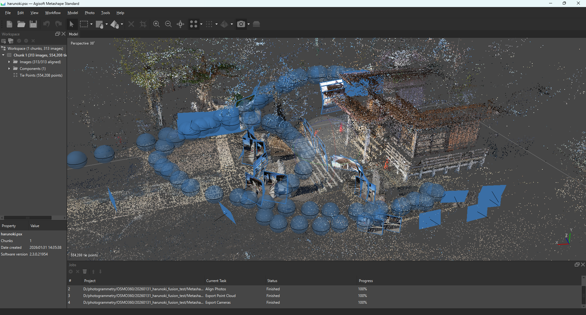
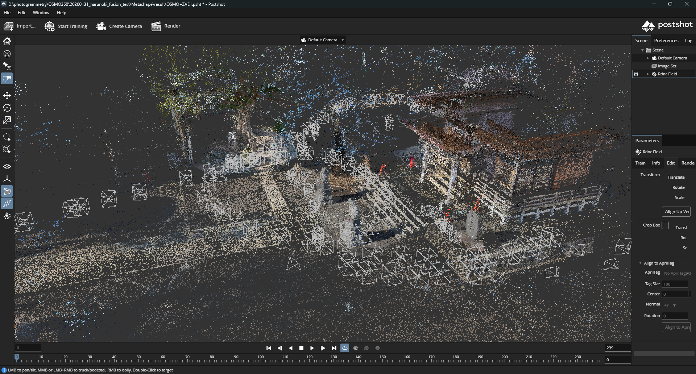

# Metashape 360° to COLMAP Converter

English | 日本語

## Overview / 概要
Convert Agisoft Metashape equirectangular (spherical) camera exports into COLMAP text format, while generating rectilinear crops (top/front/right/back/left/bottom) from each 360° frame. Optional PLY is converted to points3D.txt (via Open3D).

Now supports mixed camera types (spherical + fisheye/frame) in the same Metashape project. Non-spherical cameras are undistorted to PINHOLE model and added to the COLMAP dataset.



*Example: Metashape project with mixed camera types (spherical + frame)*



*Example: 3DGS training result using PostShot with mixed camera data*

Refer to my X
- https://x.com/naribubu/status/2015376645360849394
- https://x.com/naribubu/status/2016517770876440901

Refer to other URL
- https://lilea.net/lab/equirectangular-3dgs-with-licht-feld-studio/
- https://note.com/grand_loris6426/n/ne67d281505d5

## Features / 特長
- **Mixed camera support**: Handles spherical (360°), fisheye (equidistant), and frame (standard) cameras in one project
- Equirectangular → Cubemap: 6 rectilinear 90° crops per frame (top/front/right/back/left/bottom), multi-process available
- **Automatic undistortion**: Non-spherical cameras are undistorted to PINHOLE model using OpenCV
- Writes COLMAP `cameras.txt`, `images.txt`, `points3D.txt`
- Optional PLY transform/export (needs Open3D)
- Adjustable FoV and crop size; vertical flip for sampling equirect
- Optional image-count cap for quick tests
- Generate masks for human (YOLO-based)

## Requirements / 必要環境
- Metashape Standard (https://www.agisoft.com/features/standard-edition/)
- Python 3.9+
- pip: `numpy`, `pillow`, `opencv-python`
- Optional: `ultralytics`(for generate mask for human by YOLO), `open3d` (for PLY → points3D)

## Usage / 使い方
### SfM with Camera type as Spherical in Metashape
- [Tools] -> [Camera Calibration] -> [Camera type] -> [Spherical]
### Export Cameras as XML and Point cloud as PLY files from Metashape
- [File] -> [Export Cameras...] -> select xml type
- [File] -> [Export Point Cloud...] -> select ply type
### Python CLI example
```bash
python metashape_360_to_colmap.py \
  --images /path/to/equirect_frames \
  --xml /path/to/metashape_cameras.xml \ # Specify xml exported from Metashape
  --output /path/to/output_colmap \
  --ply /path/to/pointcloud.ply \ # Specify ply exported from Metashape
  --crop-size 1920 \ 
  --fov-deg 90 \
  --num-workers 4 \
  --max-images 50 \ # If you test quickly, specify small number. default 10000
  --generate-masks # mask for human if needed　
```

### Key options / 主なオプション
- `--images` (req): Directory of equirectangular images
- `--xml` (req): Metashape XML export (cameras)
- `--output` (req): Output folder (COLMAP text + crops in `images/`)
- `--ply`: Optional PLY to export `points3D.txt` and `points3D.ply`
- `--crop-size`: Crop resolution (square). Default 1920.
- `--fov-deg`: Horizontal FoV of rectilinear crops. Default 90.
- `--max-images`: Limit number of source equirects for quick tests (default 10000)
- `--num-workers`: Number of process for image reframing (default 4)
- `--skip-bottom`: Ignore bottom images for 3DGS training (default false)
- `--generate-masks` : Generate masks for human
- `--invert-mask` : Invert mask color from BLACK to WHITE 

### Outputs / 出力
- `output/ images/`: Cropped images (4 per input frame)
- `output/ masks/`: Mask images for human if the option (--generate-masks) is specified
- `output/ tmp`: tmp folder for generating mask process. Able to delete after finishing
- `output/ cameras.txt`
- `output/ images.txt`
- `output/ points3D.txt` (+ `points3D.ply` when PLY given)
- 

## Notes / 補足
- I confirmed that it worked with PostShot for 3DGS train.
- **Supported camera types**:
  - `spherical`: 360° equirectangular images (cropped into 6 directions)
  - `frame`: Standard frame cameras with Brown-Conrady distortion model
  - `equidistant_fisheye`: Fisheye cameras with equidistant projection model
- Multiple sensors are supported; each non-spherical sensor gets a unique PINHOLE camera ID after undistortion
- Uses the first component transform when multiple are present
- Intrinsics per crop are PINHOLE with `fx=fy=(w/2)/tan(fov/2)`, `cx=cy=w/2`
- If orientations look wrong, verify top/front/right/back/left/bottom yaw definitions and FoV

## License / ライセンス
MIT
